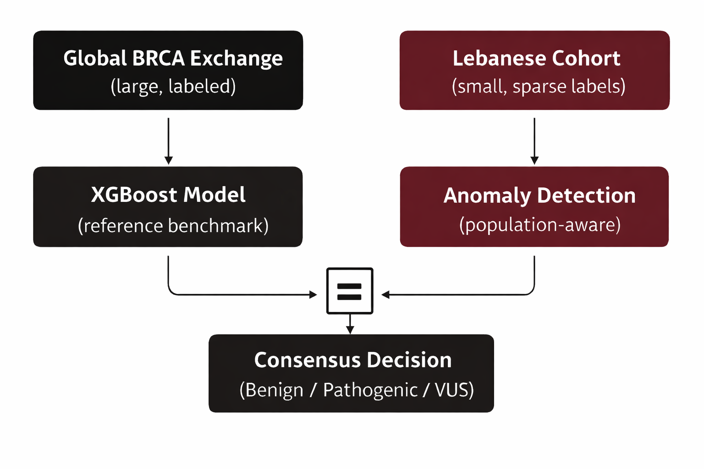

# An Equity-Driven Framework for BRCA1/2 Variant Interpretation in Data-Limited Populations: Integrating Global Supervised Learning with Population-Aware Anomaly Detection

---

<p align="center">
  
</p>

---

## Description

This repository contains code to reproduce the experiments from the paper:

**"An Equity-Driven Framework for BRCA1/2 Variant Interpretation in Data-Limited Populations: Integrating Global Supervised Learning with Population-Aware Anomaly Detection"** by Rida Assaf, Zein Shehabeddine, Halim Saad and Nada Assaf.

The framework combines:
- A **global supervised model** trained on high-confidence BRCA variants.
- A **population-aware anomaly detection model** for cohort-specific adaptation.

The goal is robust **variant classification (Benign / Pathogenic / VUS)** in underrepresented populations.

---

## Pipeline Overview

Two distinct pipelines are used:

### 1. Global Variants (BRCA Exchange)
- Already annotated.
- Used for global model training.

### 2. Local Variants (Lebanese Cohort)
- Require annotation using VEP + dbNSFP.
- Used for inference and population aware modeling.

Both pipelines converge into:

Annotated Data → Feature Processing → Model Training / Inference → Final Classification

---

## Quick Start

To reproduce the core experiment on global variants:

1. Download BRCA Exchange dataset: https://brcaexchange.org/release/73
2. Run:
   ```
   process_global_vcf.ipynb
   model.ipynb
   ```

---

## Full Setup

### Docker

```bash
docker build -t brca_vus_framework .
docker run -it brca_vus_framework
```

### Required External Files

Download manually:

- Reference genome:
  ```
  Homo_sapiens.GRCh37.dna.primary_assembly.fa.gz
  ```

- dbNSFP plugin:
  ```
  dbNSFP4.9a_grch37.gz
  ```

These are required for VEP annotation of the local variants.

---

### Install Python Dependencies

```bash
pip install -r requirements.txt
```

---

## Processing Global Variants (BRCA Exchange)

Download data:
https://brcaexchange.org/release/73

### Steps

1. Download BRCA Exchange dataset
2. Run:
   ```
   process_global_vcf.ipynb
   ```

### Output

- Clean feature tables for model training

---

## Processing Local Variants (VCF)

### Step 1: Annotate VCF

```bash
chmod +x annotate_full.sh
./annotate_full.sh
```

### Step 2: Process Annotated VCF

Run:

```
process_local_vcf.ipynb
```

### Output

- Feature tables compatible with the trained model

---

## Model Training and Inference

Run:

```
model.ipynb
```

### Inputs

- Processed global dataset (training)
- Processed local dataset (inference)

### Outputs
- Model metrics on global/local data.
- Feature importances.
- Lebanse VUS classification:
  - Benign
  - Pathogenic
  - VUS

---

## Reference

- To be added when published

Please cite this paper if you find our work useful.